# HostPanel Self-Hosted PaaS Blueprint

This blueprint outlines the complete system architecture, API specifications, secure configuration, and deployment orchestrations required to set up a robust, secure, self-hosted Platform as a Service (PaaS) controlled by the HostPanel Mobile App.

---

## 1. High-Level System Architecture

The following diagram illustrates how the HostPanel Mobile App, the Host Server Control Plane API, the Docker Daemon, and the Caddy Reverse Proxy interact to deploy and manage isolated containers.

```mermaid
sequenceDiagram
    autonumber
    actor User as Developer / Admin
    participant App as HostPanel Mobile App
    participant Proxy as Caddy Reverse Proxy (TLS 1.3)
    participant API as Host API Control Plane (Node.js/Go)
    participant Docker as Docker Engine Daemon
    participant Git as Remote Git (GitHub/GitLab)

    User->>App: Launch Deploy App (Next.js preset)
    App->>Proxy: POST /api/deploy (Secure Bearer JWT Token)
    Proxy->>API: Route to Internal Control Plane Service
    
    rect rgb(18, 24, 36)
        Note over API,Docker: Deployment Flow Execution
        API->>Git: git clone [repo_url] -b [branch]
        Git-->>API: Source Code Pulled
        API->>API: Template Dockerfile & Caddy Router mapping
        API->>Docker: docker build -t [project_name]:latest .
        Docker-->>API: Container Image Registered
        API->>Docker: docker run -d --name [project_name] --network paas-net
        Docker-->>API: Container Spawned & Healthy
        API->>Proxy: Update Router mappings & Trigger SSL (Let's Encrypt)
        API->>API: Write Secure Audit Trail Entry (SUCCESS)
    end

    API-->>App: Return Deployment Success (Container ID, Domain URL)
    App-->>User: Visual Success State (Click to visit live site)
```



---

## 2. Secure Control Plane API Reference

All requests must be encrypted via TLS 1.3 and require authentication via a signed JSON Web Token (JWT) in the headers: `Authorization: Bearer <JWT_TOKEN>`.

### 1. Fetch System Host Metrics
* **Endpoint:** `GET /api/metrics`
* **Response Body:** `HostMetrics`
* **Output Example:**
```json
{
  "cpuUsagePercent": 34.2,
  "ramTotalGb": 8.0,
  "ramUsedGb": 4.12,
  "diskTotalGb": 160.0,
  "diskUsedGb": 42.4,
  "networkRxMb": 18.25,
  "networkTxMb": 5.4,
  "osInfo": "Ubuntu 22.04 LTS (Jammy Jellyfish)",
  "dockerVersion": "Docker Engine v24.0.7",
  "uptimeSeconds": 432000
}
```

### 2. List Deployed Projects / Containers
* **Endpoint:** `GET /api/containers`
* **Response Body:** `List<ContainerInfo>`
* **Output Example:**
```json
[
  {
    "id": "c_nx129481",
    "name": "web-portfolio",
    "image": "portfolio:latest",
    "status": "running",
    "created": "2 days ago",
    "ports": "80:3000, 443:3000",
    "customDomain": "portfolio.yourdomain.com",
    "framework": "nextjs",
    "cpuPercent": 1.2,
    "memoryUsageMb": 72.4
  }
]
```

### 3. Deploy New Container Application
* **Endpoint:** `POST /api/deploy`
* **Request Body:** `DeployRequest`
```json
{
  "projectName": "web-portfolio",
  "gitUrl": "https://github.com/developer/portfolio.git",
  "branch": "main",
  "framework": "nextjs",
  "customDomain": "portfolio.yourdomain.com",
  "targetPort": 3000,
  "envVars": {
    "NODE_ENV": "production",
    "DATABASE_URL": "postgresql://..."
  }
}
```
* **Response Body:** `DeployResponse`
```json
{
  "success": true,
  "message": "Deployment completed successfully. Container web-portfolio is live.",
  "containerId": "c_nx129481",
  "url": "https://portfolio.yourdomain.com"
}
```

### 4. Container Management Controls
* **Start Container:** `POST /api/containers/{name}/start`
* **Stop Container:** `POST /api/containers/{name}/stop`
* **Restart Container:** `POST /api/containers/{name}/restart`
* **Delete Container:** `DELETE /api/containers/{name}`
* **Retrieve Real-Time Logs:** `GET /api/containers/{name}/logs`
* **Security Audit Logs:** `GET /api/audit-logs`

---

## 3. Dynamic Dockerfile Templating

To allow developers to deploy different frameworks, the Control Plane API dynamically generates and writes the appropriate `Dockerfile` inside the cloned repository's root directory before executing `docker build`.

### A. Next.js / Node.js Preset
```dockerfile
# Multi-stage optimized Next.js Dockerfile
FROM node:18-alpine AS dependency_installer
WORKDIR /app
COPY package*.json ./
RUN npm ci --only=production

FROM node:18-alpine AS builder
WORKDIR /app
COPY --from=dependency_installer /app/node_modules ./node_modules
COPY . .
RUN npm run build

FROM node:18-alpine AS runner
WORKDIR /app
ENV NODE_ENV=production
COPY --from=builder /app/.next ./.next
COPY --from=builder /app/public ./public
COPY --from=builder /app/package.json ./package.json
COPY --from=builder /app/node_modules ./node_modules

EXPOSE 3000
CMD ["npm", "start"]
```

### B. Django (Python) Preset
```dockerfile
FROM python:3.10-slim
ENV PYTHONUNBUFFERED=1
ENV PYTHONDONTWRITEBYTECODE=1

WORKDIR /app
RUN apt-get update && apt-get install -y --no-install-recommends build-essential && rm -rf /var/lib/apt/lists/*

COPY requirements.txt ./
RUN pip install --no-cache-dir -r requirements.txt

COPY . .
EXPOSE 8000
CMD ["gunicorn", "--bind", "0.0.0.0:8000", "--workers", "3", "myproject.wsgi"]
```

### C. Spring Boot (Java Maven) Preset
```dockerfile
# Build Phase
FROM maven:3.8-openjdk-17 AS build_stage
WORKDIR /app
COPY pom.xml .
COPY src ./src
RUN mvn clean package -DskipTests

# Run Phase
FROM eclipse-temurin:17-jre-alpine
WORKDIR /app
COPY --from=build_stage /app/target/*.jar app.jar
ENV PORT=8080
EXPOSE 8080
CMD ["java", "-jar", "app.jar"]
```

---

## 4. Advanced Security Best Practices

### A. Network & Encryption in Transit
1. **Enforced TLS 1.3:** The Caddy reverse proxy must be configured to discard connections below TLS 1.3:
   ```caddy
   (tls_config) {
       tls {
           protocols tls1.3
       }
   }
   ```
2. **Automated Let's Encrypt:** Caddy handles dynamic ACME certificates out-of-the-box, requesting SSL validation when updated dynamically via API triggers.

### B. Access Control & Microservices
1. **JSON Web Tokens (JWT) with RS256:** The HostPanel mobile app authenticates using asymmetric private/public keys. The server signs JWTs with a private key, and the Control Plane API validates using a local public key.
2. **Rate Limiting:** Protect control plane endpoints against brute-force or DDoS attacks using memory-rate limits (e.g., token-bucket limiters: maximum 60 requests/minute per authenticated client).
3. **Scoped API Keys:** Internal microservices communicate using cryptographically random SHA-256 tokens bounded to specific CRUD capabilities (e.g., `metrics:read`, `containers:deploy`).

### C. System & Audit Logging
* Every deployment action, port bind, starting, stopping, or container deletion writes an immutable entry into the server's audit logs.
* Schema specifications require timestamps, authentication actors, action labels, affected targets, and resolution status to protect the system's compliance and debugging capabilities.
